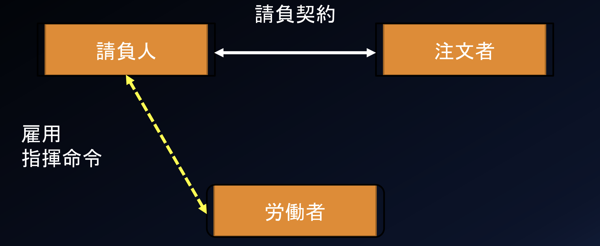
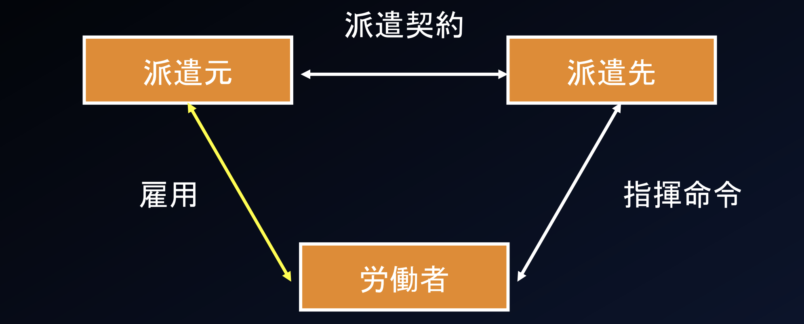
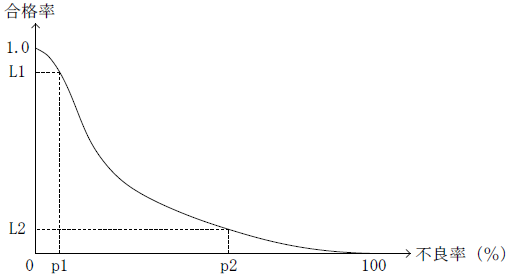

# システム開発と情報化テスト対策

### JAN コードの特徴
- 情報として国番号やメーカ番号が含まれている。
  - JAN コードは，商品コード表示用バーコードである。２バイト系の万国 統一文字コードは，Unicode である。
  - JAN コードは海外の規格（EAN／UPC）との互換性がある。
  - JAN コードは，１次元バーコードである。２次元バーコードとしては，QR コードがある。

### 産業財産権
- 特許権
- 実用新案権
- 意匠権
- 商標権

### ABC分析
ABC 分析（パレート分析）は，商品や製品，サービスなどを，３段階（Ａ，Ｂ，Ｃ）に分割して管理する手法のこと。

` 例題 `

不良品の個数を製品別に集計すると表のようになった。ABC 分析に基づいて対策を取るべきＡ群の製品は何種類か。Ａ群は，累計割合の70％までを占めるものとする。

| 製品 | P | Q | R | S | T | U | V | W | X | 合計 |
| :--- | :--- | :--- | :--- | :--- | :--- | :--- | :--- | :--- | :--- | :--- |
| 個数 | 182 | 136 | 120 | 98 | 91 | 83 | 70 | 60 | 35 | 875|

`解答`
1) 各製品は不良品の個数の降順に整列されているので，不良品の個数の累計を求める。

| 製品 | P | Q | R | S | T | U | V | W | X |
| :--- | :--- | :--- | :--- | :--- | :--- | :--- | :--- | :--- | :--- |
| 個数 | 182 | 136 | 120 | 98 | 91 | 83 | 70 | 60 | 35 | 875|
| 累計 | 182 | 318 | 438 | 536 | 627 | 710 | 780 | 840 | 875 |

2) 合計に対する各製品の累計割合（累計÷合計）を計算する。

| 製品 | P | Q | R | S | T | U | V | W | X |
| :--- | :--- | :--- | :--- | :--- | :--- | :--- | :--- | :--- | :--- |
| 割合 | 21% | 36% | 50% | 61% | 72% | 81% | 89% | 96% | 100% |

### マクシミン原理
最小利得の中で最大の利得を得られる戦略を最適戦略とする考え方である。

`例題`

Ａ社とＢ社がそれぞれ２種類の戦略を選ぶ場合の利得が表のように予想されるとき，両社がそれぞれマクシミン原理で戦略を選んだ場合のＡ社の利得はどれか。ここで，表の各欄において，左側の数値がＡ社の利得，右側の数値がＢ社の利得とする。

`解答`
1) 各社がマクシミン原理で選んだ場合の戦略を求める。
・Ａ社：戦略a1 の最小値 (－15)＜戦略a2 の最小値 (0) ⇒ 戦略a2 を選択
・Ｂ社：戦略b1 の最小値 (－5) ＞戦略b2 の最小値 (－20) ⇒ 戦略b1 を選択
2) Ａ社の利得を求める。
Ａ社が戦略a2，Ｂ社が戦略b1 を選択したときのＡ社の利得は５となる。

## 経営組織

### 事業部制組織
製造・販売部門などを製品別・顧客別・地域別・プロジェクト別などの組織単位（事業部）に分割し，それぞれの事業部ごとに利益責任をもたせる経営組織である。

### プロジェクト組織
特定の課題を解決（又は目的を達成）するために，各部門から集められた専門家で一時的に編制される経営組織である。

### マトリックス組織
プロジェクト組織と職能別組織を交流させ，経営環境の変化に柔軟に対応していくための経営組織である。
・ラインアンドスタッフ組織：生産や販売などを担当するライン部門と，総務や経理などを担当するスタッフ部門で構成さ
れる経営組織である。

### 裁量労働制
実際の労働時間については労働者の裁量に任せ,“みなし労働時間”で給与を支給する制度。

## 減価償却

## 定率法
毎月の未償却残高に一定の償却率をかける。各会計年度の減価償却費は、初年度が最も高く、年度を重ねるに連れて低くなる。

*期末の未償却残高×償却率*

`例題`

100 万円で購入した機械装置の減価償却を６年の定率法で実施するとき，１年目の償却費が32 万円となった。このとき，２年目の償却費は約何万円になるか。

1) １年目の償却費から，償却率を求める。
　１年目の償却費＝１年目の期末の未償却残高×償却率  
　　320,000＝1,000,000×償却率 ⇒ 償却率＝0.32
2) ２年目の償却費を求める。
　２年目の償却費＝２年目の期末の未償却残高×償却率  
　　＝(1,000,000－320,000)×0.32＝217,600 ⇒ 約22 万円

## 定額法
取得価額から残存価額を引き、その差額を耐用年数で割る。各会計年度の減価償却費は一定。

償却費=(取得価額-残存価額)/耐用年数

### 不正競争防止法
- 特許権を取得した発明は，特許法で保護される。
- 頒布されている情報は社会に公然と知られているため，営業秘密に該当しない。
- 秘密として管理されていないため，営業秘密に該当しない。

## 雇用関連

### 民法

- **請負契約**：請負人が注文者に対して仕事の完成を約束し，注文者が請負人に対して仕事の結果に対する報酬の支払いを約束する契約
  

- **委任契約**：委任者が法律行為を委託し，受任者が承諾する契約。法律行為ではない委任契約のことを，一般的には(準)委任契約という

- **派遣契約** 

### レーダチャート
複数の評価項目について，基準の形を設定し，その基準に対する比率をプロットし，線で結んだ形により項目間のバランスを表すチャートである。したがって，“複数の評価項目に基づく製品の機能優劣を表示する”ために利用するのが適している。
- 営業部員ごとの今月の製品販売数を表示する。（棒グラフを利用するのが適している）
- 製品に対する各社の市場占有率を表示する。（円グラフを利用するのが適している）
- 製品の年度ごとの売上数の推移を表示する。（折れ線グラフを利用するのが適している）

### 財務諸表

#### 貸借対照表
 一定時点（通常は期末時点）における企業の財政状態を明らかにする財務諸表で，借方（左側）に資産，貸方（右側）に負債及び純資産を表示する。
#### 仕訳帳
 会計期間中の取引を，日付順に記録する帳簿である。

### ゴーイングコンサーン（継続的事業体）
“企業は企業活動を無期限に継続し，社会的責任・使命を果たし続ける”という，企業の前提となる考え方である。この前提があることにより，企業に投資したり，企業の提供するサービスを利用したりすることができる。

### グリーンIT
IT 社会全体の省エネルギー化を推進する地球環境保護への取組み

### ディスクロージャ（企業内容開示）
企業の内部状況を社会に対して公開する活動

### CSR（企業の社会的責任）
社会や地域に対して企業が果たすべき責任のことである。

### PL法(製造物責任法)
製造物(製品)の欠陥によって、身体・生命・財産に損害を与えた場合における製造業者等の損害賠償の責任について定めた法律である。

`損害賠償責任が生じない例`
- 家電量販店で20 年前に購入したテレビが，ディジタル放送に対応していないため使えなくなった（製造物（テレビ）を引き渡してから10 年が経過しているので，損害賠償責任は生じない。また，10 年前の当時の技術では，ディジタル放送の普及も認識できなかったと考えられる）
- ダウンロードしたプログラムがウイルスに感染していて，PC の重要なデータが消去された（製造物とは，製造又は加工された動産であるため，プログラムは損害賠償責任の対象とはならない。また，ウイルスに感染したことが原因であり，製造物の欠陥ではない）
- パソコンにインストールされていたソフトウェアで株を購入したところ，不況で株価が急激に下落した（株価が下落した原因（不況）は製造物の欠陥ではないため，損害賠償責任は生じない）

### 管理図
QC 七つ道具の一つであり，平常値を表す管理中心線（CL)，平常値の上限を表す上方管理限界線（UCL)，平常値の下限を表す下方管理限界線（LCL）を記入し，データ（平均値）をプロットして折れ線グラフで表示する図である。主に，品質管理に用いられる。

### OC 曲線（検査特性曲線）
製品の抜取り検査などに用いられる図解

`例題`

図は，ある製品ロットの抜取り検査の結果を表すOC 曲線（検査特性曲線）である。
この図が表しているものはどれか。

- a. 不良率がp1 よりも小さいロットが不合格となる確率は，(1.0－L1)以上である。
- b. 不良率がp2 よりも大きいロットが合格する確率は，L2 以下である。
- c. 不良率がp1 よりも大きいロットが合格する確率は，L1 以上である。
- d. 不良率がp2 よりも小さいロットが不合格となる確率は，(L1－L2)以下である。

`解答`
- 不良率がp2 よりも大きいロットが合格する確率は，L2 以下である。（正解）
- 不良率がp1 よりも大きいロットが合格する確率は，L1 以下である。
- 不良率がp1 よりも小さいロットが不合格となる確率は，(1.0－L1）以下である。
- 不良率がp2 よりも小さいロットが不合格となる確率は，(1.0－L2）以下である。

### ブレーンストーミング
解決したい問題や実現したいことに関する意見／アイデアを，数多く収集するための方法である。次の四つのルールに従うことで，発言者は自由な発想で意見を述べることができ，斬新なアイデアが期待できる。
- 批判禁止：他人の発言を批判してはいけない。
- 自由奔放：目的から少々ずれていても，大胆に，自由に発言する。
- 質より量：良い意見よりも，多くの意見を出すようにする。
- 便乗歓迎：他人の意見に便乗したり，結合したりしても構わない。

