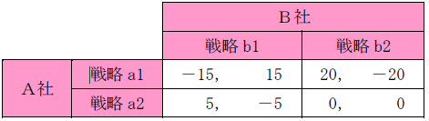

# システム開発と情報化テスト対策

### JAN コードの特徴
- 情報として国番号やメーカ番号が含まれている。
  - JAN コードは，商品コード表示用バーコードである。２バイト系の万国 統一文字コードは，Unicode である。
  - JAN コードは海外の規格（EAN／UPC）との互換性がある。
  - JAN コードは，１次元バーコードである。２次元バーコードとしては，QR コードがある。

### 産業財産権
- 特許権
- 実用新案権
- 意匠権
- 商標権

### ABC分析
ABC 分析（パレート分析）は，商品や製品，サービスなどを，３段階（Ａ，Ｂ，Ｃ）に分割して管理する手法のこと。

` 例題 `

不良品の個数を製品別に集計すると表のようになった。ABC 分析に基づいて対策を取るべきＡ群の製品は何種類か。Ａ群は，累計割合の70％までを占めるものとする。

| 製品 | P | Q | R | S | T | U | V | W | X | 合計 |
| :--- | :--- | :--- | :--- | :--- | :--- | :--- | :--- | :--- | :--- | :--- |
| 個数 | 182 | 136 | 120 | 98 | 91 | 83 | 70 | 60 | 35 | 875|

`解答`
1) 各製品は不良品の個数の降順に整列されているので，不良品の個数の累計を求める。

| 製品 | P | Q | R | S | T | U | V | W | X |
| :--- | :--- | :--- | :--- | :--- | :--- | :--- | :--- | :--- | :--- |
| 個数 | 182 | 136 | 120 | 98 | 91 | 83 | 70 | 60 | 35 | 875|
| 累計 | 182 | 318 | 438 | 536 | 627 | 710 | 780 | 840 | 875 |

2) 合計に対する各製品の累計割合（累計÷合計）を計算する。

| 製品 | P | Q | R | S | T | U | V | W | X |
| :--- | :--- | :--- | :--- | :--- | :--- | :--- | :--- | :--- | :--- |
| 割合 | 21% | 36% | 50% | 61% | 72% | 81% | 89% | 96% | 100% |

### マクシミン原理
最小利得の中で最大の利得を得られる戦略を最適戦略とする考え方である。

`例題`

Ａ社とＢ社がそれぞれ２種類の戦略を選ぶ場合の利得が表のように予想されるとき，両社がそれぞれマクシミン原理で戦略を選んだ場合のＡ社の利得はどれか。ここで，表の各欄において，左側の数値がＡ社の利得，右側の数値がＢ社の利得とする。

`解答`
1) 各社がマクシミン原理で選んだ場合の戦略を求める。
・Ａ社：戦略a1 の最小値 (－15)＜戦略a2 の最小値 (0) ⇒ 戦略a2 を選択
・Ｂ社：戦略b1 の最小値 (－5) ＞戦略b2 の最小値 (－20) ⇒ 戦略b1 を選択
2) Ａ社の利得を求める。
Ａ社が戦略a2，Ｂ社が戦略b1 を選択したときのＡ社の利得は５となる。

## 経営組織

### 事業部制組織
製造・販売部門などを製品別・顧客別・地域別・プロジェクト別などの組織単位（事業部）に分割し，それぞれの事業部ごとに利益責任をもたせる経営組織である。

### プロジェクト組織
特定の課題を解決（又は目的を達成）するために，各部門から集められた専門家で一時的に編制される経営組織である。

### マトリックス組織
プロジェクト組織と職能別組織を交流させ，経営環境の変化に柔軟に対応していくための経営組織である。
・ラインアンドスタッフ組織：生産や販売などを担当するライン部門と，総務や経理などを担当するスタッフ部門で構成さ
れる経営組織である。

### 裁量労働制
実際の労働時間については労働者の裁量に任せ,“みなし労働時間”で給与を支給する制度。

## 減価償却

## 定率法
毎月の未償却残高に一定の償却率をかける。各会計年度の減価償却費は、初年度が最も高く、年度を重ねるに連れて低くなる。

*期末の未償却残高×償却率*

`例題`

100 万円で購入した機械装置の減価償却を６年の定率法で実施するとき，１年目の償却費が32 万円となった。このとき，２年目の償却費は約何万円になるか。

1) １年目の償却費から，償却率を求める。
　１年目の償却費＝１年目の期末の未償却残高×償却率  
　　320,000＝1,000,000×償却率 ⇒ 償却率＝0.32
2) ２年目の償却費を求める。
　２年目の償却費＝２年目の期末の未償却残高×償却率  
　　＝(1,000,000－320,000)×0.32＝217,600 ⇒ 約22 万円

## 定額法
取得価額から残存価額を引き、その差額を耐用年数で割る。各会計年度の減価償却費は一定。

償却費=(取得価額-残存価額)/耐用年数

### 不正競争防止法
* 特許権を取得した発明は，特許法で保護される。
* 頒布されている情報は社会に公然と知られているため，営業秘密に該当しない。
* 秘密として管理されていないため，営業秘密に該当しない。

