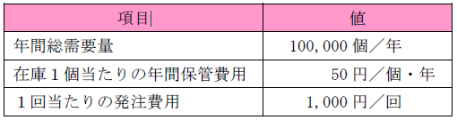

# システム開発と情報化テスト対策

## JAN コードの特徴
- 情報として国番号やメーカ番号が含まれている。
  - JAN コードは，商品コード表示用バーコードである。２バイト系の万国 統一文字コードは，Unicode である。
  - JAN コードは海外の規格（EAN／UPC）との互換性がある。
  - JAN コードは，１次元バーコードである。２次元バーコードとしては，QR コードがある。

## 産業財産権
- 特許権
- 実用新案権
- 意匠権
- 商標権

## ABC分析
ABC 分析（パレート分析）は，商品や製品，サービスなどを，３段階（Ａ，Ｂ，Ｃ）に分割して管理する手法のこと。

` 例題 `

不良品の個数を製品別に集計すると表のようになった。ABC 分析に基づいて対策を取るべきＡ群の製品は何種類か。Ａ群は，累計割合の70％までを占めるものとする。

| 製品 | P | Q | R | S | T | U | V | W | X | 合計 |
| :--- | :--- | :--- | :--- | :--- | :--- | :--- | :--- | :--- | :--- | :--- |
| 個数 | 182 | 136 | 120 | 98 | 91 | 83 | 70 | 60 | 35 | 875|

`解答`
1) 各製品は不良品の個数の降順に整列されているので，不良品の個数の累計を求める。

| 製品 | P | Q | R | S | T | U | V | W | X |
| :--- | :--- | :--- | :--- | :--- | :--- | :--- | :--- | :--- | :--- |
| 個数 | 182 | 136 | 120 | 98 | 91 | 83 | 70 | 60 | 35 | 875|
| 累計 | 182 | 318 | 438 | 536 | 627 | 710 | 780 | 840 | 875 |

2) 合計に対する各製品の累計割合（累計÷合計）を計算する。

| 製品 | P | Q | R | S | T | U | V | W | X |
| :--- | :--- | :--- | :--- | :--- | :--- | :--- | :--- | :--- | :--- |
| 割合 | 21% | 36% | 50% | 61% | 72% | 81% | 89% | 96% | 100% |

## マクシミン原理
最小利得の中で最大の利得を得られる戦略を最適戦略とする考え方である。

`例題`

Ａ社とＢ社がそれぞれ２種類の戦略を選ぶ場合の利得が表のように予想されるとき，両社がそれぞれマクシミン原理で戦略を選んだ場合のＡ社の利得はどれか。ここで，表の各欄において，左側の数値がＡ社の利得，右側の数値がＢ社の利得とする。

`解答`
1) 各社がマクシミン原理で選んだ場合の戦略を求める。
・Ａ社：戦略a1 の最小値 (－15)＜戦略a2 の最小値 (0) ⇒ 戦略a2 を選択
・Ｂ社：戦略b1 の最小値 (－5) ＞戦略b2 の最小値 (－20) ⇒ 戦略b1 を選択
2) Ａ社の利得を求める。
Ａ社が戦略a2，Ｂ社が戦略b1 を選択したときのＡ社の利得は５となる。

## マクシマックス原理
各戦略で最良の場合，つまり最大利得の中で最大の利得を得られる戦略を最適戦略とする考え方

## ミニマックスリグレット原理
それぞれの状況について，最良の戦略を選んだ場合に予測される利得と，実際に採用した戦略の利得との差（リグレット）の最大値が最小となる戦略を最適戦略とする考え方

## ラプラスの原理
それぞれの状況が同じ確率で起こると仮定し，期待値原理に基づいて最適戦略を求める考え方

## 経営組織

### 事業部制組織
製造・販売部門などを製品別・顧客別・地域別・プロジェクト別などの組織単位（事業部）に分割し，それぞれの事業部ごとに利益責任をもたせる経営組織である。

### プロジェクト組織
特定の課題を解決（又は目的を達成）するために，各部門から集められた専門家で一時的に編制される経営組織である。

### マトリックス組織
プロジェクト組織と職能別組織を交流させ，経営環境の変化に柔軟に対応していくための経営組織である。
・ラインアンドスタッフ組織：生産や販売などを担当するライン部門と，総務や経理などを担当するスタッフ部門で構成さ
れる経営組織である。

## 職能別組織（ヨコ型構造組織）
経理部，営業部，総務部などのように，専門職種や役割（企業における諸活動の性 質）によって部門に分ける組織構造である。

### 裁量労働制
実際の労働時間については労働者の裁量に任せ,“みなし労働時間”で給与を支給する制度。

## 減価償却

## 定率法
毎月の未償却残高に一定の償却率をかける。各会計年度の減価償却費は、初年度が最も高く、年度を重ねるに連れて低くなる。

*期末の未償却残高×償却率*

`例題`

100 万円で購入した機械装置の減価償却を６年の定率法で実施するとき，１年目の償却費が32 万円となった。このとき，２年目の償却費は約何万円になるか。

1) １年目の償却費から，償却率を求める。
　１年目の償却費＝１年目の期末の未償却残高×償却率  
　　320,000＝1,000,000×償却率 ⇒ 償却率＝0.32
2) ２年目の償却費を求める。
　２年目の償却費＝２年目の期末の未償却残高×償却率  
　　＝(1,000,000－320,000)×0.32＝217,600 ⇒ 約22 万円

## 定額法
取得価額から残存価額を引き、その差額を耐用年数で割る。各会計年度の減価償却費は一定。

償却費=(取得価額-残存価額)/耐用年数

### 不正競争防止法
- 特許権を取得した発明は，特許法で保護される。
- 頒布されている情報は社会に公然と知られているため，営業秘密に該当しない。
- 秘密として管理されていないため，営業秘密に該当しない。

## 雇用関連

### 民法

- **請負契約**：請負人が注文者に対して仕事の完成を約束し，注文者が請負人に対して仕事の結果に対する報酬の支払いを約束する契約
  

- **委任契約**：委任者が法律行為を委託し，受任者が承諾する契約。法律行為ではない委任契約のことを，一般的には(準)委任契約という

- **派遣契約** 

## アローダイアグラム

### 最早結合点時刻
次の作業を最も早く開始できる時刻。
複数の矢印が入ってくる結合点の最早結合点時刻は最も大きい値になる

### 最遅結合点時刻
次の作業を遅くてもこの時刻までには開始しなくてはならないという時刻。最遅結合点時刻の場合は矢印が複数出ていく結合点では最も小さい値を選びます。

`例題`
図のアローダイアグラムにおいて，結合点④の最早結合点時刻と最遅結合点時刻の組合せとして，適切なものはどれか。ここで，①の開始時を０とする。

`解答`
問題のアローダイアグラムの最早結合点時刻と最遅結合点時刻を求めると，次のようになる。

したがって，結合点④の最早結合点時刻は８，最遅結合点時刻は10 となる。

正答: 最早結合点時刻：8，最遅結合点時刻：10

### クリティカルパス
https://www.jooto.com/contents/critical-path/#i-3

`例題2`
あるプロジェクトの作業を，図のような日程計画で開始したところ，作業Ａの終了時点で１日の遅れが生じた。各作業を１日短縮するために必要な費用（短縮費用）が表のとおりであるとき，できるだけ費用をかけずにプロジェクトを計画どおりに終了するには，どの作業の日数を１日短縮するべきか。

このプロジェクトにおけるクリティカルパスは“Ａ→Ｃ→Ｄ→Ｅ→Ｇ”で，所要日数は26日である。作業Ａの１日の遅れ を取り戻すには，クリティカルパス上の作業Ｃ，Ｄ，Ｅ，Ｇのいずれかを１日短縮すればよい。したがって，四つの作業の 中で短縮費用が３万円で最も安い作業「Ｄ」を１日短縮すればよい。

正答: D

## レーダチャート
複数の評価項目について，基準の形を設定し，その基準に対する比率をプロットし，線で結んだ形により項目間のバランスを表すチャートである。したがって，“複数の評価項目に基づく製品の機能優劣を表示する”ために利用するのが適している。
- 営業部員ごとの今月の製品販売数を表示する。（棒グラフを利用するのが適している）
- 製品に対する各社の市場占有率を表示する。（円グラフを利用するのが適している）
- 製品の年度ごとの売上数の推移を表示する。（折れ線グラフを利用するのが適している）

## 財務諸表

#### 貸借対照表
 一定時点（通常は期末時点）における企業の財政状態を明らかにする財務諸表で，借方（左側）に資産，貸方（右側）に負債及び純資産を表示する。
#### 仕訳帳
 会計期間中の取引を，日付順に記録する帳簿である。

## ゴーイングコンサーン（継続的事業体）
“企業は企業活動を無期限に継続し，社会的責任・使命を果たし続ける”という，企業の前提となる考え方である。この前提があることにより，企業に投資したり，企業の提供するサービスを利用したりすることができる。

## グリーンIT
IT 社会全体の省エネルギー化を推進する地球環境保護への取組み

## ディスクロージャ（企業内容開示）
企業の内部状況を社会に対して公開する活動

## CSR（企業の社会的責任）
社会や地域に対して企業が果たすべき責任のことである。

## PL法(製造物責任法)
製造物(製品)の欠陥によって、身体・生命・財産に損害を与えた場合における製造業者等の損害賠償の責任について定めた法律である。

`損害賠償責任が生じない例`
- 家電量販店で20 年前に購入したテレビが，ディジタル放送に対応していないため使えなくなった（製造物（テレビ）を引き渡してから10 年が経過しているので，損害賠償責任は生じない。また，10 年前の当時の技術では，ディジタル放送の普及も認識できなかったと考えられる）
- ダウンロードしたプログラムがウイルスに感染していて，PC の重要なデータが消去された（製造物とは，製造又は加工された動産であるため，プログラムは損害賠償責任の対象とはならない。また，ウイルスに感染したことが原因であり，製造物の欠陥ではない）
- パソコンにインストールされていたソフトウェアで株を購入したところ，不況で株価が急激に下落した（株価が下落した原因（不況）は製造物の欠陥ではないため，損害賠償責任は生じない）

## 管理図
QC 七つ道具の一つであり，平常値を表す管理中心線（CL)，平常値の上限を表す上方管理限界線（UCL)，平常値の下限を表す下方管理限界線（LCL）を記入し，データ（平均値）をプロットして折れ線グラフで表示する図である。主に，品質管理に用いられる。

## OC 曲線（検査特性曲線）
製品の抜取り検査などに用いられる図解

`例題`

図は，ある製品ロットの抜取り検査の結果を表すOC 曲線（検査特性曲線）である。
この図が表しているものはどれか。

- a. 不良率がp1 よりも小さいロットが不合格となる確率は，(1.0－L1)以上である。
- b. 不良率がp2 よりも大きいロットが合格する確率は，L2 以下である。
- c. 不良率がp1 よりも大きいロットが合格する確率は，L1 以上である。
- d. 不良率がp2 よりも小さいロットが不合格となる確率は，(L1－L2)以下である。

`解答`
- 不良率がp2 よりも大きいロットが合格する確率は，L2 以下である。（正解）
- 不良率がp1 よりも大きいロットが合格する確率は，L1 以下である。
- 不良率がp1 よりも小さいロットが不合格となる確率は，(1.0－L1）以下である。
- 不良率がp2 よりも小さいロットが不合格となる確率は，(1.0－L2）以下である。

## ブレーンストーミング
解決したい問題や実現したいことに関する意見／アイデアを，数多く収集するための方法である。次の四つのルールに従うことで，発言者は自由な発想で意見を述べることができ，斬新なアイデアが期待できる。
- 批判禁止：他人の発言を批判してはいけない。
- 自由奔放：目的から少々ずれていても，大胆に，自由に発言する。
- 質より量：良い意見よりも，多くの意見を出すようにする。
- 便乗歓迎：他人の意見に便乗したり，結合したりしても構わない。

## JIS規格
- JIS Q 15001：個人情報保護マネジメントシステムに関する規格である。
- JIS Q 20000：サービスマネジメントシステムに関する規格である。
- JIS Q 27001：情報セキュリティマネジメントシステムに関する規格である。
- JIS Q 14001：環境マネジメントシステムに関する規格である。

### 理論
- 待ち行列理論：何らかのサービスを待っている列，あるいはそのような列を作る事象をモデル化し，待ち時間や待ち人数などを統計的に推測する手法
- XY 理論：人間には，“命令統制のＸ理論”と“自己統制のＹ理論”という対立的な理論があることを提唱した理論であり，モチベーション管理などに活用される。
- グラフ理論：節点と辺又は枝の集合で構成されるグラフを用いるための理論
- ゲーム理論：プレイヤがゲームに勝つための最適戦略を検討する理論

## 著作権法
著作物を私的使用の目的で複製した場合は，著作権侵害とならない。

- 学校その他の教育機関においては，公表された著作物を必要と認められる限度において複製しても著作権侵害とならない。ただし，著作権者の利益を不当に害する場合はこの限りではないので，市販されている問題集を出版元の許可なく複写する行為は著作権の侵害となる。
- プログラムのバックアップを目的とした複製は，著作権の侵害とはならない。ただし，複製禁止を目的としたコピーガード（コピープロテクト）を強制的に外して複製する行為は，目的がバックアップであっても著作権の侵害となる。
- ホームページに掲載することは，公衆に対して送信可能化する複製に該当するため，著作権侵害となる。

## ワークサンプリング法
ある時点での観測対象が，どのような作業状態にあったかという瞬間観測を何回か行い，稼働状況や作業時間などを推定する手法である。

## 法律

### 金融商品取引法
金融商品取引業を行う者に関して必要な事項を定め，有価証券の発行及び金融商品等の取引などを公正に行えるようにするための法律である。この法律では，有価証券報告書や内部統制報告書の提出を義務付けている。

### IT 基本法
高度情報通信ネットワーク社会の形成に関して，基本理念及び施策の策定に係る基本方針を定めた法律である。

### 情報公開法
行政機関などが作成した行政文書や法人文書の情報公開を，誰でも請求できることを定めた法律である。

### 電子文書法（e-文書法）
民間事業者等が行う書面（紙）による保存などに代わり，電磁的記録（ディジタルデータ）による保存などを行うことを容認する法律である。

## 営業利益
営業利益＝売上総利益－販売費及び一般管理費＝(売上高－売上原価)－販売費及び一般管理費

`例題`

期末の決算において，表の損益計算資料が得られた。当期の営業利益は何百万円か。

単位：百万円

項目	金額  
売上高	1,500  
売上原価	1,000  
販売費および一般管理費	200  
営業外収益	40  
営業外費用	30  

`解答`

営業利益＝売上総利益－販売費及び一般管理費
　＝(売上高－売上原価)－販売費及び一般管理費
　＝(1,500－1,000)－200
　＝300（百万円）

正答: 300

## 定期発注方式
発注間隔をあらかじめ決めておいて，発注ごとに需要の予測を行い，発注量を計算する発注方式である。単価が高く，売上全体に占める割合も高い，重点管理が必要なＡランク商品の発注に適している。

## 定期発注法
発注ごとに需要の予測を行って発注量を計算するので発注量が一定とは限らない。

## 発注点法（定量発注方式）
発注量が一定で，発注時期が決まっていない発注方式である。

## EOQ(経済的発注量)
在庫総費用（在庫保管費用＋発注費用）が最小となる発注量

`例題`

次の表に示す製品のEOQ は，およそ何個になるか。

`解答`

EOQ（経済的発注量）は，次の公式で求めることができる。

## 損益分岐点売上高

`例題1`
損益計算書から算出した各項目が表の値のとき，損益分岐点売上高は何千円か。

単位：千円  
項目	金額  
売上高	1,000  
変動費	800  
固定費	100  
利益	100  

損益分岐点売上高は，次式により求めることができる。

損益分岐点売上高=固定費/(1-(変動費/売上高))

よって、100/(1-(800/100))=100/0.2=500(千円)

`例題2`
表に示す損益計算における損益分岐点売上高は何百万円か。

① 固定費と変動費を，それぞれ求める。

固定費＝売上原価の固定費＋販売費及び一般管理費の固定費
　＝200百万円＋280百万円＝480百万円

変動費＝売上原価の変動費＋販売費及び一般管理費
　＝100百万円＋80百万円＝180百万円

② 損益分岐点売上高を求める。

損益分岐点売上高＝固定費÷(1－変動費÷売上高)
　＝480百万円÷(1－180百万円÷900百万円)
　＝「600」百万円

正答: 600

## KJ 法
ブレーンストーミングなどの技法で収集された多数の意見を整理する際に用いられる。収集した情報を類似しているものでグループ化し，それらを図解し，整理したものを文書化することで問題点を明確にする。KJ は発案者の川喜田二郎の頭文字である。

### 契約

## サイトライセンス契約
サイトライセンス契約（コーポレートライセンス契約）は，特定企業や団体などが使用している複数のコンピュータや複数のユーザでの使用を一括して認める契約である。

## ボリュームライセンス契約
インストールできるコンピュータの台数をあらかじめ規定する契約

## クライアントアクセスライセンス
サーバのソフトウェアをクライアントが利用する権利を認める契約

## シュリンクラップ契約
パッケージを開けた時点で，ソフトウェア利用許諾書に同意したと見なされる契約

## オイラーグラフ
グラフを構成する全ての辺をただ一度だけ通る小道が存在するグラフである。

始点と終点を除く，全ての節点の辺の数が偶数でなければならない。
オイラーグラフとは，一筆書きが可能な無向グラフである。一筆書きが可能であるということは，始点と終点以外の 節点には，入る辺に対応する出る辺が必ず存在する。したがって，始点と終点を除く，全ての節点の辺の数が偶数で なければならない。

- グラフを構成する節点の総数が偶数でなければなければならない（節点の総数が奇数であっても，図１のようなオイラーグラフが考えられる）
- グラフを構成する辺の総数が偶数でなければならない（辺の総数が奇数であっても，図２のようなオイラーグラフが考えられる）
- 始点と終点を含む，全ての節点の辺の数が偶数でなければならない（始点及び終点に関しては辺の数が奇数であっても，図３のようなオイラーグラフが考えられる）

## 表を読む問題
次の表は，顧客からの注文に対するＤ社の出荷基準を表した決定表である。この決定表から判断できる記述として，適切なものはどれか。

既存客でなければ，経理課が承認していない注文は全て断る。
既存客でない（条件“既存客である”がＮ）とき，経理課が承認していない（条件“経理課が承認している”がＮ）場合は注文を断る。（正解）

- 既存客であっても，経理課が承認していなければ出荷しない（既存客（条件“既存客である”がＹ）であれば，経理課が承認していない（条件“経理課が承認している”がＮ）場合でも，注文量が１ダース以下（条件“注文量≦１ダース”がＹ）で手持在庫以上（条件“手持在庫≧注文量”がＹ） ならば出荷する）
- 既存客であれば，注文量が１ダース以下の注文は無条件に出荷する（既存客で注文量が１ダース以下でも，手持在庫がない（条件“手持在庫≧注文量”がＮ）場合は品切れと連絡する）
- 注文量が１ダース以上ならば，無条件で注文を断る（注文量が１ダースを超える（条件“注文量≦１ダース”がＮ）場合は無条件で注文を断るが，注文量が１ダース（条件“注文量≦１ダース”がＹ）の場合はその他の条件により注文を断るかどうかを決定する）

正答: 既存客でなければ，経理課が承認していない注文は全て断る。

## CIO（最高情報責任者）
全社的観点から情報管理，情報システムの統括を含む情 報化戦略を立案し，それを執行することである。情報システム（サービス）の活用を促進したり，システム化の基本方針や システムの全体構想を明確にする情報システムの全体計画を策定するのもCIOの役割の一つである。

## システムアドミニストレータ
企業内システムに関して，利用者の立場から要望や提言を行って整備を促進する

## CISO（Chief Information Security Officer；最高情報セキュリティ責任者）
企業のセキュリティ管理に関する基本方針を策定し，個別のセキュリティ対策を立案する

## CEO（Chief Executive Officer；最高経営責任者）
総合的な視点で企業を統括し，経営方針や経営戦略の策定などのトップマネジメントを行う

## 平均応答時間

`例題`
あるシステムには，１時間に平均180件のアクセスがある。アクセス１件に対するシステムの処理時間が平均12秒であるとき，このシステムの平均応答時間は約何秒か。なお，このシステムの待ち行列はM/M/1モデルに従うものとする。

①平均到着率（λ）
　＝180件÷(1時間×60分／時間)＝3件／分

②平均サービス時間（1／μ）
　＝12秒／件÷60秒／分＝0.2分／件

③窓口処理率（ρ）
　＝λ×(1／μ)＝3件／分×0.2分／件＝0.6

④平均滞留数（Lw）
　＝ρ÷(1－ρ)＝0.6÷(1－0.6)＝1.5（件）

⑤平均待ち時間（Tw）
　＝Lw×(1／μ)＝1.5件×0.2分／件＝0.3分

⑥ 平均応答時間（Tq）
　＝Tw＋(1／μ)＝0.3分＋0.2分＝0.5分　⇒　「30」秒

正答: 30

## SLCP-JCF（Software Life Cycle Process-Japan Common Frame）
ソフトウェア開発とその取引の適正化に向けて，それらのベースとなる作業項目を定義し，取得者と供給者に“共通のものさし”を提供する共通フレームである。

## EJB（Enterprise JavaBeans）
Javaで開発されたプログラムを，アプリケーションの部品として取り扱うための規約であるJavaBeans仕様と同様のものを，ネットワーク分散型ビジネスアプリケーションのサーバ側で実現した標準仕様である。

## ISO/IEC 20000
サービスマネジメントシステムに関する規格である。

## JIS X 5070
セキュリティ機能をもつIT製品の開発／評価及び購入のための指針として，セキュリティ技術及び情報技術セキュリティの評価基準を規定している規格である。

## ISO 9000認証
組織の品質マネジメント体制について，ISO 9000に適合しているかを審査する制度である

